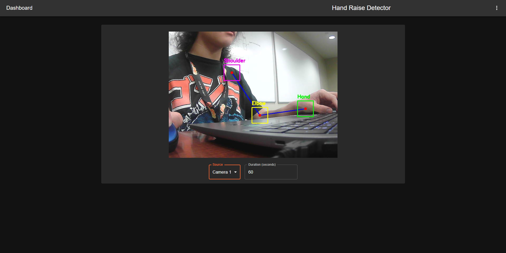

# bmquin.github.io

## About me!

## Projects
Here are the projects I have worked on or have been a part of so far.

### HandRaising
Developed during Knight Hacks 8
The premise of this project was to create an app that would detect when students raised their hand in a classroom using a connected video capture device (e.g. a webcam). When a hand that is raised is detected, it would then begin a timer, counting down from a user-defined amount of time. Once the timer hit zero, it would alert the teacher that a student has had their hand raised and required their attention.

The Devpost for the project can be found here: [HandRaising Devpost](https://devpost.com/software/hand-raise-detector)

The video demo for the project can be seen here: 

### M Programming Language
Developed for Project Lauch Spring 2025

### MANUS Assistive Robotic Arm 
more coming soon :3